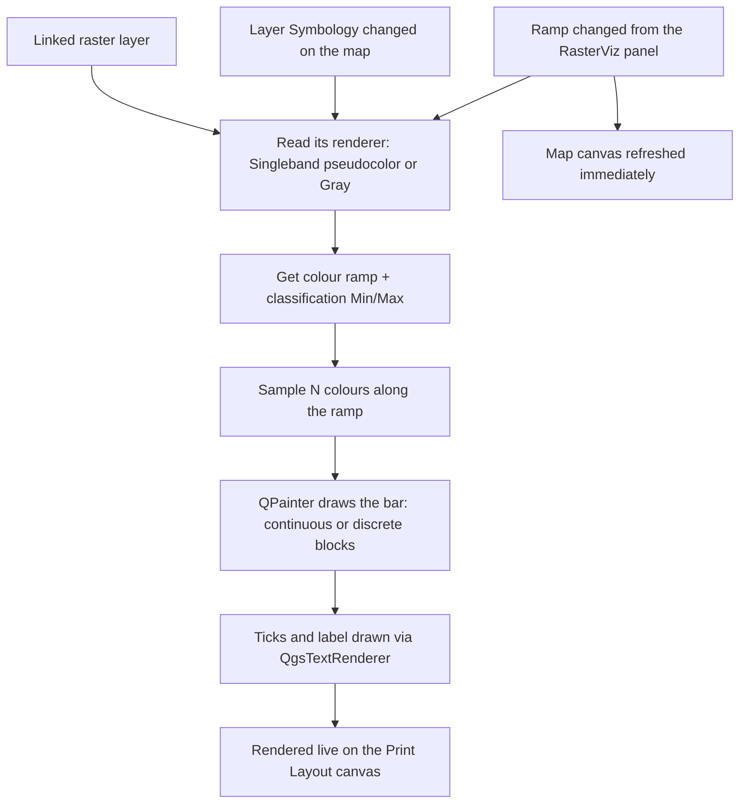
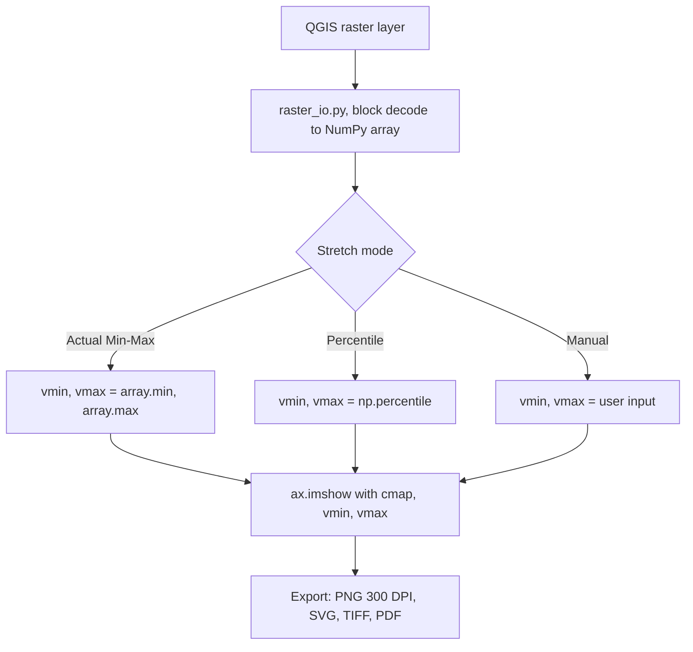

# RasterViz, Scientific Raster Visualization for QGIS


[](https://plugins.qgis.org/plugins/qrviz/)
[](https://plugins.qgis.org/plugins/qrviz/)

QGIS plugin that produces scientific/publication-style raster visualizations. Built as a few different approaches over time, a standalone dialog window with a full toolkit (colormap gallery, stretch modes, RGB composite, vector overlays, web basemaps, one-shot export), and now a native Layout item for building the same scientific-style colorbar directly inside a QGIS Print Layout. Each approach has been progressively simplified so the same publication-style result is easier to get to. Zero third-party Python dependencies, in every release.

Author: Defani Arman Alfitriansyah


## What's New

### v2.11.2 (Layout-native), latest

| Version | Change |
|---|---|
| 2.11.2 | Fixed the plugin being blocked by the QGIS Plugin Repository's automated security scan (Bandit "Try, Except, Pass detected", 20 findings across `colorbar_item.py`, `colorbar_panel.py` and `qrviz.py`). Every bare `except Exception: pass` on an optional/best-effort path now logs via `QgsMessageLog.logMessage()` under a "RasterViz" tab instead of silently discarding the error. No behavioural change on the happy path |
| 2.11.1 | Old "QRVIZ"-tagged colour ramps left over from versions ≤ 2.6.0 are now cleared from QGIS's style database on startup, so the "Raster colour ramp" picker stays QGIS-built-ins-only for upgraders too, not just fresh installs |
| 2.11.0 | Removed the native Position and Size / Rotation / Item ID / Rendering / Variables block from the bottom of the panel, position the item by dragging it on the layout canvas instead, resizing stays covered by the Width/Height fields |
| 2.10.1 | Collapsed the panel's item heading from two lines down to one, and added the plugin's own icon next to it |
| 2.10.0 | Added "Min"/"Max" and "Interpolation" (Discrete/Linear/Exact) controls to the panel, editing them updates the linked raster's renderer immediately, no manual refresh needed |
| 2.9.2 | Fixed the printed map inside the Layout still showing old raster colours after a ramp change until "Refresh view" was pressed, Map items now invalidate and redraw immediately too |
| 2.9.1 | Fixed the RasterViz dock panel landing in its own row instead of joining the native Items/Item Properties/Layout/Guides tab group on first install |

Full history in [`rasterviz-v2-layout-native/README.md`](rasterviz-v2-layout-native/README.md) and the plugin's own `metadata.txt` `changelog` field.

### v1.4.5

| Version | Change |
|---|---|
| 1.4.5 | Fixed 10 Bandit B110/B112 findings, caught exceptions on optional fallback paths now log via `QgsMessageLog` instead of silently discarding |
| 1.4.4 | Fixed basemap/overlay alignment offset, now uses QGIS's `visibleExtent()` instead of the raw requested extent |
| 1.4.3 | Removed the 300px cap on the settings panel width |
| 1.4.2 | Skips the no-data mask loop entirely for blocks with no no-data pixels (`hasNoData()` check) |
| 1.4.1 | UI reorganized into labeled group boxes; all in-app icons removed |
| 1.4.0 | Contextily replaced by a native QGIS XYZ basemap engine, zero third-party dependencies reached |

Full history in `metadata.txt`'s `changelog` field inside the plugin folder.


## Versions

RasterViz is one plugin that's kept evolving, each release below is
an update of the same project, not a separate fork. The newest one,
**v2.11.2 (Layout-native)**, is where development is focused now: it takes
the same colorbar RasterViz has always drawn and makes it easier to
use by dropping it straight into QGIS's own Print Layout as a native
item, instead of a separate dialog window. Source for each release
lives in this repository; packaged `.zip`s are in [`releases/`](releases/).

| Version | Method | Status | Source | Download |
|---|---|---|---|---|
| **v2.11.2 (Layout-native)**, latest | Native QGIS Layout item, no separate window, drops straight into Print Layout next to Legend/Scale Bar/Picture | Pending QGIS Plugin Repository approval, install manually via **Install from ZIP** for now | [`rasterviz-v2-layout-native/`](rasterviz-v2-layout-native/) | [RasterViz-v2-layout-native-2.11.2.zip](releases/RasterViz-v2-layout-native-2.11.2.zip) |
| v1.4.5 | Standalone dialog window (Matplotlib), colormap gallery, RGB composite, web basemaps, discrete classification, single-window export | Live on [plugins.qgis.org/plugins/qrviz](https://plugins.qgis.org/plugins/qrviz/), installable from **QGIS → Plugins → Manage and Install Plugins** | [`qrviz/`](qrviz/) | [RasterViz-v1.4.5.zip](releases/RasterViz-v1.4.5.zip) |
| v1.1.0 (early release) | Standalone dialog window (Matplotlib), the first public single-band/discrete/RGB/colorbar release, before vector overlays and web basemaps existed | Archived, kept for reference, superseded by v1.4.5 | n/a | [RasterViz-v1.1.0.zip](releases/RasterViz-v1.1.0.zip) |

v1.4.5's dialog still covers the full toolkit (colormap gallery, RGB
composite, basemaps, discrete classification, one-shot figure export)
for anyone who needs it, but v2 is where the colorbar workflow itself
has moved on to: living natively inside a Print Layout alongside
QGIS's own North Arrow, Scale Bar, Grid and Legend items instead of a
separate window. See [`rasterviz-v2-layout-native/README.md`](rasterviz-v2-layout-native/README.md)
for v2's own docs.

**Why a native Layout item at all?** QGIS's own Print Layout already
has North Arrow, Scale Bar, Grid and Legend as native, drag-and-drop
items, but no colorbar item to go with them. v2 was built to fill
that one gap, not to compete with it: it drops into the same Layout
Designer, resizes and positions the same way as any other native
item, and reads its colours straight from the linked raster layer's
own symbology, so it feels like it always belonged there. It's kept
deliberately narrow (just the colorbar) so it stays a small,
complementary addition to QGIS's native layout toolkit, while v1.4.5
remains around for anyone still on the full standalone toolkit.

## Render pipeline

Each version gets its colours to the page a different way, v2 reads
straight off the raster layer's own renderer and paints directly on
the Layout canvas; v1.4.5 decodes the raster itself and hands the
array to Matplotlib.

### v2.11.2 (Layout-native)



### v1.4.5 (standalone dialog)

RasterViz reproduces `rasterio.show()`'s rendering behavior without needing rasterio, GDAL bindings, or any pip package, everything is read through QGIS-native APIs and handed to the same Matplotlib call.



## Key Features

Feature sets differ by version, v2 is scoped narrowly to the
colorbar item itself; v1.4.5 is the full standalone toolkit.

### v2.11.2 (Layout-native)

| Area | Capability |
|---|---|
| Panel | Dedicated "RasterViz" dock panel added to every Layout window automatically, follows the current selection, one-click "+ Add Colorbar" button |
| Layer support | Singleband pseudocolor or Singleband gray, kept live-synced with the layer's own Symbology |
| Orientation & size | Horizontal or vertical, explicit width/height (what's typed is exactly what the bar draws at) |
| Bar style | Continuous gradient or discrete/stepped blocks, with a configurable number of sampled colours |
| Bar shape | Optional rounded corners; optional pointed "extend" ends |
| Ticks & label | Configurable tick count, padding and decimals; independent colour and font for tick numbers and the axis label |
| Live sync | Colours and Min/Max re-read automatically when the layer's Symbology changes; changing the ramp from the panel refreshes the map canvas immediately too |
| Dependencies | Zero third-party, pure PyQGIS + PyQt5, no Matplotlib, no extra window |

### v1.4.5 (standalone dialog)

| Area | Capability |
|---|---|
| Raster rendering | Single-band continuous, discrete/classified (per-class color, label, decimals), RGB composite with independent per-band stretch |
| Colormaps | Custom scientific palettes (NDVI, LST, mangrove/carbon stock, SAR backscatter) plus the full Matplotlib set |
| Stretch modes | Actual min-max, percentile, or manual vmin/vmax |
| Vector overlays | Shapefile, GeoPackage, GeoJSON, KML/KMZ with single or categorized (by-field) symbology |
| Basemaps | 49 providers (Esri, OSM, CartoDB, OpenTopoMap, NASA GIBS, national agencies), rendered natively via `QgsMapRendererCustomPainterJob` |
| Cartographic tools | Pointed colorbar, DMS/DM/DD/UTM coordinate ticks, north arrow, scale bar |
| Export | PNG (300 DPI), SVG, TIFF, PDF |

## Installation

The newest release, **RasterViz v2.11.2 (Layout-native)**, is still
pending QGIS Plugin Repository approval, so for now it installs
manually:

1. Download [`releases/RasterViz-v2-layout-native-2.11.2.zip`](releases/RasterViz-v2-layout-native-2.11.2.zip)
2. In QGIS: **Plugins → Manage and Install Plugins → Install from ZIP**, point it at the downloaded file, and click **Install Plugin**
3. Open a Print Layout, the colorbar item and its **RasterViz** dock panel appear automatically

If what's needed is the full standalone toolkit instead (colormap
gallery, RGB composite, basemaps, discrete classification, one-shot
export), install **v1.4.5** the normal way:

1. In QGIS: **Plugins → Manage and Install Plugins → All**, search for **RasterViz**, and click **Install Plugin** (pulls v1.4.5 directly from the official repository)
2. Alternatively, download the ZIP from the [plugin's Versions page](https://plugins.qgis.org/plugins/qrviz/#plugin-versions), or from this repo's [`releases/`](releases/) folder, and install via **Install from ZIP**
3. Open it from **Raster menu → RasterViz**, or the toolbar icon

If upgrading from a v1.3.x install that used the old "Install Dependencies" button, delete the old plugin folder first so no leftover `vendored/` folder gets picked up.

## Requirements

| Requirement | Detail |
|---|---|
| QGIS | 3.0 – 3.99, with its bundled Python 3 |
| Third-party dependencies | None, raster/vector reading and web basemaps are 100% QGIS-native (`QgsRasterLayer`, `QgsVectorLayer`, `QgsMapRendererCustomPainterJob`) |

## RasterViz v2, Layout-native method, in more detail

The rationale and short version live in [Versions](#versions) above
("Why a native Layout item at all?"). For the full write-up, panel
walkthrough, and every setting v2 exposes, see
[`rasterviz-v2-layout-native/README.md`](rasterviz-v2-layout-native/README.md).

## Notes

- Basemap alignment is exact even for non-Web-Mercator CRSes, since QGIS's own renderer performs the reprojection rather than a manual tile-warp.
- Basemap tiles are cached per (provider, CRS, view), so an unrelated control tweak (title, font, decimals) doesn't re-fetch or re-render the basemap.
- RasterViz began as this QGIS plugin, was rebuilt as a [standalone desktop edition](https://github.com/Defani/RasterViz) to run without QGIS, then ported back into the QGIS plugin in v1.2.0.

## Acknowledgments & Credits

RasterViz only exists because of the open-source GIS and Python communities that built the tools it stands on. A humble thank-you to the developers behind each of them.

**Currently powering RasterViz (shared by both versions):**

| Project | License | What it does for RasterViz |
|---|---|---|
| [QGIS](https://qgis.org/) / PyQGIS | GNU GPL v2+ | The desktop GIS platform itself, raster reading, vector reading, coordinate transforms, and the web basemap render pipeline (`QgsRasterLayer`, `QgsVectorLayer`, `QgsMapRendererCustomPainterJob`) |
| PyQt5 (via `qgis.PyQt`) | GPL v3 (Riverbank Computing) | The GUI toolkit behind the v1.4.5 dialog and the v2 RasterViz dock panel |

**Pattern & data credits for the native basemap engine (since v1.4.0):**

| Project | License | Credit |
|---|---|---|
| [QuickMapServices](https://github.com/qgis/QuickMapServices) | GNU GPL v2+ | The native `type=xyz&zmin=…&zmax=…&url=…` connection pattern that `basemap_io.py` follows |
| [xyzservices](https://github.com/geopandas/xyzservices) / [leaflet-providers](https://github.com/leaflet-extras/leaflet-providers) | BSD 2-Clause | Tile URL templates, zoom limits, and attribution strings |
| Klas Karlsson ([reference script](https://bit.ly/4eDbx1O)) | n/a | The expanded basemap batch added in v1.4.0 (BaseMapDE, TopPlusOpen, SwissFederalGeoportal, nlmaps, USGS, WaymarkedTrails, OpenSnowMap, and others) |

**Historical thanks (powered the v1.x dialog line, not needed by v2):**

| Project | License | Powered |
|---|---|---|
| [Matplotlib](https://matplotlib.org/) | Matplotlib License (BSD-compatible) | The entire v1.x rendering backbone, every colormap, colorbar, north arrow, scale bar, and export (PNG/SVG/TIFF/PDF), from v1.1.0 through v1.4.5; v2 draws everything itself with pure PyQGIS/PyQt5 instead |
| [NumPy](https://numpy.org/) | BSD 3-Clause | Array operations behind pixel reading, stretch calculation (min-max/percentile), and the QImage → RGBA conversion for basemaps, v1.1.0 through v1.4.5; not needed by v2 |
| [Contextily](https://contextily.readthedocs.io/) | BSD 3-Clause | Web basemap layer, v1.2.0–v1.3.1, before the native engine replaced it |
| [Rasterio](https://rasterio.readthedocs.io/) | BSD 3-Clause | Raster reading, v1.1.0–v1.2.0, before the switch to `QgsRasterLayer` |
| [GDAL](https://gdal.org/) | MIT | Underlying raster/vector I/O for Rasterio and Fiona in early releases |
| [GeoPandas](https://geopandas.org/) | BSD 3-Clause | Vector reading, v1.2.0, before the switch to `QgsVectorLayer`/OGR |
| [Fiona](https://fiona.readthedocs.io/) | BSD 3-Clause | Vector reading, v1.2.0, alongside GeoPandas |
| [QtAwesome](https://github.com/spyder-ide/qtawesome) | MIT | Toolbar/layer-panel icons through v1.2.0, replaced by a built-in SVG icon set in v1.3.0, then removed entirely in v1.4.1 |

*Special thanks to the global open-source community for continuing to democratize geospatial technology, and to everyone who writes the papers whose figures made me want to build this in the first place.*

## A note from the author

I'm still a beginner at all this, I started RasterViz mostly because I kept admiring the clean, publication-style raster figures in remote sensing papers and wanted that same look available natively inside QGIS, without needing to leave for a separate Python script every time. Every library and every maintainer credited above did the hard part; I'm just grateful to be able to stand on it. If you spot something that could be better, I'd genuinely welcome the feedback.

## License

GNU General Public License v2.0 or later, see [LICENSE](LICENSE). Matplotlib and NumPy are BSD-licensed; PyQGIS and PyQt5 are GPL v2.

## Citation

```
Alfitriansyah, D. A. (2026). RasterViz: Scientific Raster Visualization Plugin for QGIS
(Version 1.4.5) [Software]. https://github.com/Defani/RasterViz
```
