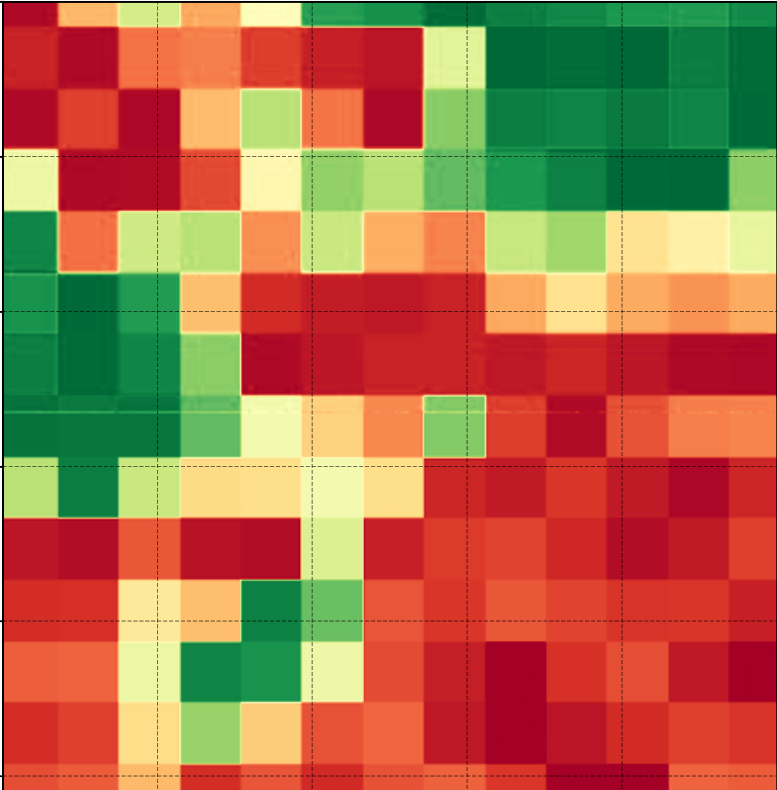

 

# **RasterViz** — QGIS Plugin

> ⚠️ **Note on the official QGIS Plugin Repository:** as of this writing, the listing at **[plugins.qgis.org/plugins/qrviz](https://plugins.qgis.org/plugins/qrviz/)** is still on **v1.1.0** and has not been updated to v1.4.0. Download the latest release from this repository's Releases page instead.


**RasterViz** is a publication-quality raster & vector visualization plugin for QGIS, styled after `rasterio.show()`. Pick a colormap, choose a stretch, drop a legend, overlay vector data, add a web basemap, grid, scale bar, and north arrow — then export at 300 DPI.


---

## 🆕 What's New in v1.4.0 — Zero Third-Party Dependencies

The web basemap layer used to be powered by [contextily](https://contextily.readthedocs.io/) (a pip package) — the *only* third-party dependency RasterViz had left after v1.3.0. In v1.4.0, that's gone entirely.

* **Native QGIS basemap engine.** Basemaps are now fetched, tiled, and reprojected entirely by QGIS itself — a native `QgsRasterLayer` XYZ connection (the same URI scheme the [QuickMapServices](https://github.com/qgis/QuickMapServices) plugin uses). No more contextily, no more GDAL virtual file I/O, no more tile warping.
* **"Install Dependencies" removed.** The header button, the one-time first-run notice, and the whole `deps_manager` / `deps_worker` / `deps_dialog` install flow are gone — there's nothing left to install.
* **Same alignment guarantees.** Because QGIS's own renderer does the reprojection (not a manual tile-warp), basemap alignment against your raster/vector layers is exact — including for non-Web-Mercator CRSes.
* **Same basemap cache.** Per-(provider, CRS, view) caching still works exactly as before — an unrelated control tweak (title, font, decimals…) doesn't re-render the basemap from scratch.
* **More basemaps.** The provider list grew from 24 to **49** entries — Esri polar imagery, NASA GIBS (VIIRS night lights, MODIS true color, ASTER shaded relief), several national mapping agencies (Germany, Switzerland, Netherlands, United States, and more), OpenStreetMap variants, and others.

RasterViz now has **zero third-party Python dependencies** — everything runs on what QGIS already ships (PyQGIS, NumPy, Matplotlib, PyQt5).

---

## ✨ Key Features

* **🗂️ Interactive Layer Manager:** Manage any number of raster and vector layers in one panel — mix layers already in your QGIS project with ones opened directly from disk.
* **🛰️ Raster Rendering:** Single-band rendering (continuous & discrete/classified with per-class color, label, and decimals) plus RGB composite with independent per-band stretch.
* **🎨 Colormap Library:** Custom scientific palettes (NDVI, LST, mangrove/carbon stock, SAR backscatter, and more) alongside the full Matplotlib colormap set, with percentile / min-max / manual stretch modes.
* **🗺️ Vector Symbology:** Render Shapefiles, KML/KMZ, and GeoPackages with customizable fill, stroke, and categorized (by-field) colors.
* **🌐 Dynamic Basemaps:** Instantly overlay your data on 49 basemaps — Esri, OpenStreetMap, CartoDB, OpenTopoMap, NASA GIBS, national mapping agencies, and more — drawn behind your layers, rendered natively by QGIS.
* **📐 Cartographic Tools:** Coordinate grid with DMS / DM / Decimal Degree / UTM tick formatting, scale bar, and a dynamic north arrow.
* **🖼️ Layout / Multi-Map Series:** Compose several maps together into one figure panel.
* **🌙 Dark / Light Mode:** Follows QGIS's own active theme and font — no forced styling.
* **📸 High-Quality Export:** Save your map compositions as high-resolution PNG (300 DPI), TIFF, SVG, or PDF files.

---

## 📋 Requirements

* **QGIS 3.0 – 3.99**, with its bundled Python 3.
* **Nothing else.** Raster reading, vector reading, and web basemaps are all 100% QGIS-native (`QgsRasterLayer`, `QgsVectorLayer`, `QgsMapRendererCustomPainterJob`). There is no optional-dependency tangle. Zero runtime imports outside the PyQGIS/PyQt5/NumPy/Matplotlib stack that QGIS ships.

---

## 🚀 Installation

1. Download the latest `qrviz-x.y.z.zip` release from this repository's Releases page (**not** from plugins.qgis.org, which is still on v1.1.0 — see the note at the top of this README).
2. In QGIS: **Plugins → Manage and Install Plugins → Install from ZIP**.
3. Select the downloaded zip and click **Install Plugin**.
4. Open it from **Raster menu → RasterViz**, or the toolbar icon.

If you're upgrading from a v1.3.x install that once used the old "Install Dependencies" button, it's worth deleting the old plugin folder outright before installing the new zip, so any leftover `vendored/` folder isn't mistaken for part of the new install.

---

## 🖱️ Quick Start

1. Load a raster from your QGIS project, or click **+ Raster** inside the RasterViz dialog to open one from disk.
2. Choose single-band, discrete, or RGB mode, then pick a colormap and stretch.
3. Optionally add a vector overlay (**+ Vector**) and a basemap from the **Basemap** dropdown.
4. Adjust colorbar, grid, coordinate format, north arrow, and scale bar — the preview updates live.
5. Click **Export** to save PNG / SVG / TIFF / PDF at publication resolution.

---

## 🧭 Version History

| Version | Highlights |
|---|---|
| **1.4.0** | Contextily replaced by a native QGIS XYZ basemap engine. Zero third-party dependencies. Basemap list expanded 24 → 49. "Install Dependencies" removed entirely. |
| **1.3.1** | Fixed a Colorbar-tab layout gap; narrowed the settings panel. "Install Dependencies" gained a fallback for disabled user site-packages. Added the per-(provider, CRS, view) basemap cache. |
| **1.3.0** | Raster and vector engines made 100% QGIS-native — rasterio, geopandas, and fiona no longer needed. Vector rendering moved onto QGIS's own `QgsFeatureRequest` pipeline (reprojection, splitting, rendering). |
| **1.2.0** | Rebuilt on the multi-layer engine from the standalone RasterViz edition: unified raster+vector layer panel, vector overlays, web basemaps (via contextily), expanded colormap library, north arrow, and SVG export. |
| **1.1.0** | Initial public release — this is the version currently listed on plugins.qgis.org. Single-band continuous/discrete rendering, RGB composite, pointed colorbar, coordinate tick formatting, scale bar, PNG/PDF export. |

Full per-release notes are in `metadata.txt`'s `changelog` field inside the plugin folder.

---

## 🧭 Project History

RasterViz began as this QGIS plugin, was rebuilt as a **[standalone desktop edition](https://github.com/Defani/RasterViz)** to run without QGIS installed (adding the multi-layer panel, vector overlays, and layout engine), and then ported back into the QGIS plugin in v1.2.0.

---

## 🙏 Acknowledgments & Credits

This plugin exists because of the monumental efforts of the open-source GIS and Python community.

**Currently powering RasterViz (runtime dependencies):**

* **[QGIS](https://qgis.org/) / PyQGIS:** The desktop GIS platform this plugin is built for and built on — raster reading, vector reading, coordinate transforms, and now the web basemap render pipeline.
* **[Matplotlib](https://matplotlib.org/):** The backbone of our map rendering, turning raw arrays into beautiful cartography.
* **[NumPy](https://numpy.org/):** For the blazingly fast array operations required in image processing and the QImage → RGBA conversion behind the native basemap engine.
* **PyQt5 (via `qgis.PyQt`):** The GUI toolkit behind the entire dialog.

**Pattern & data credits for the native basemap engine (v1.4.0):**

* **[QuickMapServices](https://github.com/qgis/QuickMapServices)** (GPLv2+): the native `type=xyz&zmin=…&zmax=…&url=…` / `QgsRasterLayer(..., "wms")` connection pattern RasterViz's `basemap_io.py` now follows.
* **[xyzservices](https://github.com/geopandas/xyzservices)** / **[leaflet-providers](https://github.com/leaflet-extras/leaflet-providers)** (BSD 2-Clause): the tile URL templates, zoom limits, and attribution strings.
* **Klas Karlsson** ([reference script](https://bit.ly/4eDbx1O)): the expanded basemap batch added in v1.4.0 (BaseMapDE, TopPlusOpen, SwissFederalGeoportal, nlmaps, USGS, WaymarkedTrails, OpenSnowMap, and others).

**Historical thanks (dependencies used in earlier releases, no longer required as of v1.4.0):**

* **[Contextily](https://contextily.readthedocs.io/)** — powered the web basemap layer from v1.2.0 through v1.3.1, before being replaced by the native engine above.
* **[Rasterio](https://rasterio.readthedocs.io/)** & **[GDAL](https://gdal.org/)** — powered raster reading in v1.1.0–v1.2.0, before the switch to `QgsRasterLayer` in v1.3.0.
* **[GeoPandas](https://geopandas.org/)** & **[Fiona](https://fiona.readthedocs.io/)** — powered vector reading in v1.2.0, before the switch to `QgsVectorLayer`/OGR in v1.3.0.
* **[QtAwesome](https://github.com/spyder-ide/qtawesome)** — provided the toolbar/layer-panel icons through v1.2.0, before being replaced by a small built-in SVG icon set in v1.3.0.

*Special thanks to the global open-source community for continuing to democratize geospatial technology.*

---

**Author:** Defani Arman Alfitriansyah — defaniarman@gmail.com
**Repository:** https://github.com/Defani/RasterViz
**License:** GNU GPL v2 or later — see `LICENSE`.

## License

GNU General Public License v2.0 or later. See [LICENSE](LICENSE).

Matplotlib and NumPy are distributed under the BSD License. PyQGIS and PyQt5 are distributed under the GNU GPL v2.

---

## Citation

```
Alfitriansyah, D. A. (2026). RasterViz: Scientific Raster Visualization Plugin for QGIS
(Version 1.4.0) [Software]. https://github.com/Defani/RasterViz
```

---

<div align="center">

Built with **PyQGIS · NumPy · Matplotlib · PyQt5** — zero third-party dependencies.

[github.com/Defani/RasterViz](https://github.com/Defani/RasterViz)

</div>
