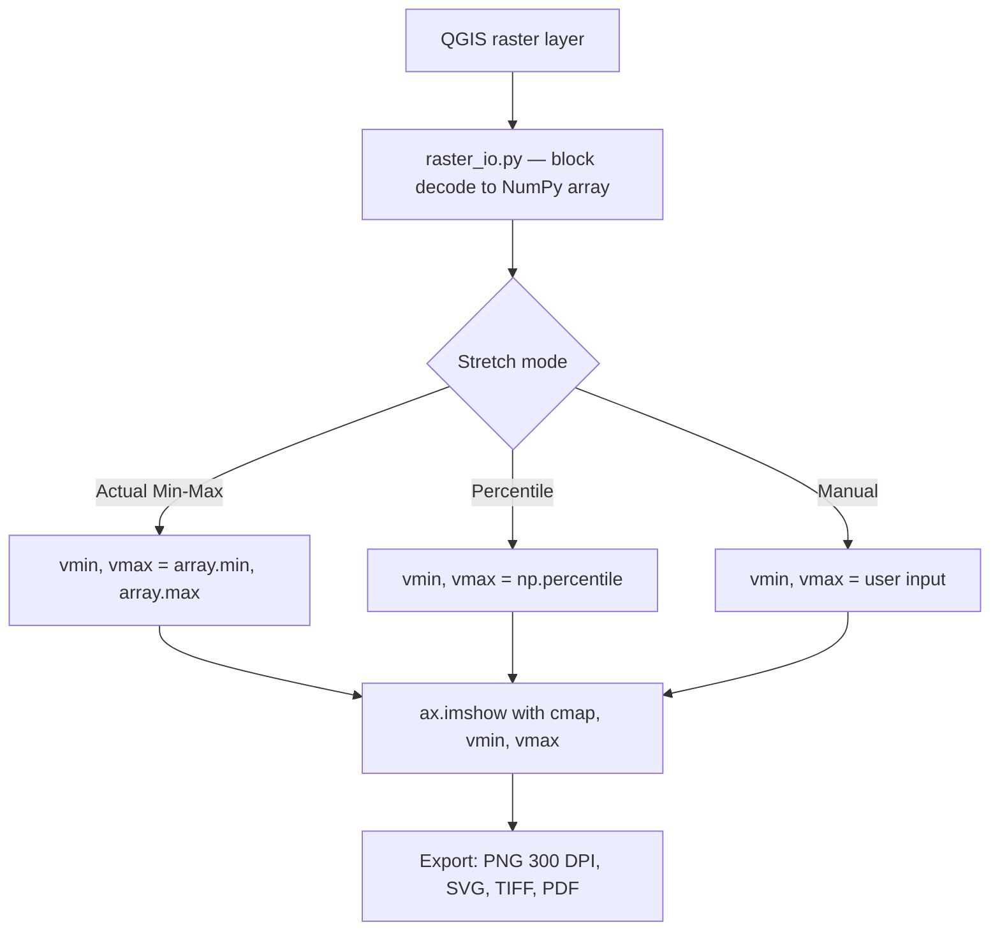

# RasterViz — Scientific Raster Visualization for QGIS


[](https://plugins.qgis.org/plugins/qrviz/)
[](https://plugins.qgis.org/plugins/qrviz/)

QGIS plugin family that renders publication-quality raster and vector maps directly inside QGIS, styled after Python's `rasterio.show()`. Pick a colormap, choose a stretch, drop a legend, overlay vector data, add a web basemap, grid, scale bar, and north arrow — then export at 300 DPI, or build the same scientific-style colorbar natively inside a QGIS Print Layout. Zero third-party Python dependencies, in every version.

Author: Defani Arman Alfitriansyah


## Versions

RasterViz ships as more than one version/method — pick whichever fits
the map you're building. Source for each lives in this repository;
packaged `.zip`s for every version are in [`releases/`](releases/).

| Version | Method | Status | Source | Download |
|---|---|---|---|---|
| **v1.4.5** (current) | Standalone dialog window (Matplotlib) — colormap gallery, RGB composite, web basemaps, discrete classification, single-window export | ✅ Live on [plugins.qgis.org/plugins/qrviz](https://plugins.qgis.org/plugins/qrviz/) — installable from **QGIS → Plugins → Manage and Install Plugins** | [`qrviz/`](qrviz/) | [RasterViz-v1.4.5.zip](releases/RasterViz-v1.4.5.zip) |
| **v2** (Layout-native) | Native QGIS Layout item — no separate window, drops straight into Print Layout next to Legend/Scale Bar/Picture | ⏳ Pending QGIS Plugin Repository approval — install manually via **Install from ZIP** for now | [`rasterviz-v2-layout-native/`](rasterviz-v2-layout-native/) | [RasterViz-v2-layout-native-2.8.0.zip](releases/RasterViz-v2-layout-native-2.8.0.zip) |
| v1.1.0 (early release) | Standalone dialog window (Matplotlib) — the first public single-band/discrete/RGB/colorbar release, before vector overlays and web basemaps existed | 🗄️ Archived — kept for reference, superseded by v1.4.5 | — | [RasterViz-v1.1.0.zip](releases/RasterViz-v1.1.0.zip) |

v1.4.5 and v2 are **alternatives, not a replacement for one another** —
v1.4.5's dialog covers the full toolkit (colormap gallery, RGB
composite, basemaps, discrete classification, one-shot figure export);
v2 is for when a scientific-style colorbar needs to live natively
inside a Print Layout alongside QGIS's own North Arrow, Scale Bar,
Grid and Legend items. See [`rasterviz-v2-layout-native/README.md`](rasterviz-v2-layout-native/README.md)
for v2's own docs.

## Render pipeline

RasterViz reproduces `rasterio.show()`'s rendering behavior without needing rasterio, GDAL bindings, or any pip package — everything is read through QGIS-native APIs and handed to the same Matplotlib call.



## Key Features

| Area | Capability |
|---|---|
| Raster rendering | Single-band continuous, discrete/classified (per-class color, label, decimals), RGB composite with independent per-band stretch |
| Colormaps | Custom scientific palettes (NDVI, LST, mangrove/carbon stock, SAR backscatter) plus the full Matplotlib set |
| Stretch modes | Actual min-max, percentile, or manual vmin/vmax |
| Vector overlays | Shapefile, GeoPackage, GeoJSON, KML/KMZ with single or categorized (by-field) symbology |
| Basemaps | 49 providers (Esri, OSM, CartoDB, OpenTopoMap, NASA GIBS, national agencies), rendered natively via `QgsMapRendererCustomPainterJob` |
| Cartographic tools | Pointed colorbar, DMS/DM/DD/UTM coordinate ticks, north arrow, scale bar |
| Export | PNG (300 DPI), SVG, TIFF, PDF |

## Installation

1. In QGIS: **Plugins → Manage and Install Plugins → All**, search for **RasterViz**, and click **Install Plugin** (pulls the latest approved version, 1.4.5, directly from the official repository)
2. Alternatively, download the ZIP from the [plugin's Versions page](https://plugins.qgis.org/plugins/qrviz/#plugin-versions), or from this repo's [`releases/`](releases/) folder, and install via **Install from ZIP**
3. Open it from **Raster menu → RasterViz**, or the toolbar icon

For **RasterViz v2 (Layout-native method)**, which isn't on
plugins.qgis.org yet, see [Versions](#versions) above — install
[`releases/RasterViz-v2-layout-native-2.8.0.zip`](releases/RasterViz-v2-layout-native-2.8.0.zip)
via **Install from ZIP**.

If upgrading from a v1.3.x install that used the old "Install Dependencies" button, delete the old plugin folder first so no leftover `vendored/` folder gets picked up.

## Requirements

| Requirement | Detail |
|---|---|
| QGIS | 3.0 – 3.99, with its bundled Python 3 |
| Third-party dependencies | None — raster/vector reading and web basemaps are 100% QGIS-native (`QgsRasterLayer`, `QgsVectorLayer`, `QgsMapRendererCustomPainterJob`) |

## What's New in v1.4.5

| Version | Change |
|---|---|
| 1.4.5 | Fixed 10 Bandit B110/B112 findings — caught exceptions on optional fallback paths now log via `QgsMessageLog` instead of silently discarding |
| 1.4.4 | Fixed basemap/overlay alignment offset — now uses QGIS's `visibleExtent()` instead of the raw requested extent |
| 1.4.3 | Removed the 300px cap on the settings panel width |
| 1.4.2 | Skips the no-data mask loop entirely for blocks with no no-data pixels (`hasNoData()` check) |
| 1.4.1 | UI reorganized into labeled group boxes; all in-app icons removed |
| 1.4.0 | Contextily replaced by a native QGIS XYZ basemap engine — zero third-party dependencies reached |

Full history in `metadata.txt`'s `changelog` field inside the plugin folder.

## RasterViz v2 — Layout-native method, in more detail

See the [Versions](#versions) table above for the short version:
v2 is pending repository approval and installs from ZIP for now.

RasterViz v2 doesn't try to replace the v1.4.5 dialog/Matplotlib
workflow described in this README — it's a different method for
getting a scientific-style colorbar when the map is being built
directly inside QGIS's own **Print Layout / Layout Designer**. Instead
of a standalone dialog window with its own export step, v2 adds a
single native Layout item straight into the Layout Designer, next to
Legend/Scale Bar/Picture, drawn with pure PyQGIS/PyQt5 (no Matplotlib)
and edited from its own docked **"RasterViz"** panel — so it sits
natively alongside QGIS's own North Arrow, Scale Bar, Grid and Legend
items instead of a separate matplotlib canvas.

Use whichever version fits the map at hand — v2 isn't meant to retire
the v1 workflow. Full docs, features and installation steps for v2
live in [`rasterviz-v2-layout-native/README.md`](rasterviz-v2-layout-native/README.md).
Once v2 clears repository approval, it'll install the normal way too.

## Notes

- Basemap alignment is exact even for non-Web-Mercator CRSes, since QGIS's own renderer performs the reprojection rather than a manual tile-warp.
- Basemap tiles are cached per (provider, CRS, view), so an unrelated control tweak (title, font, decimals) doesn't re-fetch or re-render the basemap.
- RasterViz began as this QGIS plugin, was rebuilt as a [standalone desktop edition](https://github.com/Defani/RasterViz) to run without QGIS, then ported back into the QGIS plugin in v1.2.0.

## Acknowledgments & Credits

RasterViz only exists because of the open-source GIS and Python communities that built the tools it stands on. A humble thank-you to the developers behind each of them.

**Currently powering RasterViz (runtime dependencies):**

| Project | License | What it does for RasterViz |
|---|---|---|
| [QGIS](https://qgis.org/) / PyQGIS | GNU GPL v2+ | The desktop GIS platform itself — raster reading, vector reading, coordinate transforms, and the web basemap render pipeline (`QgsRasterLayer`, `QgsVectorLayer`, `QgsMapRendererCustomPainterJob`) |
| [Matplotlib](https://matplotlib.org/) | Matplotlib License (BSD-compatible) | The entire rendering backbone — every colormap, colorbar, north arrow, scale bar, and export (PNG/SVG/TIFF/PDF) is drawn through it |
| [NumPy](https://numpy.org/) | BSD 3-Clause | Array operations behind pixel reading, stretch calculation (min-max/percentile), and the QImage → RGBA conversion for basemaps |
| PyQt5 (via `qgis.PyQt`) | GPL v3 (Riverbank Computing) | The GUI toolkit behind the entire dialog |

**Pattern & data credits for the native basemap engine (since v1.4.0):**

| Project | License | Credit |
|---|---|---|
| [QuickMapServices](https://github.com/qgis/QuickMapServices) | GNU GPL v2+ | The native `type=xyz&zmin=…&zmax=…&url=…` connection pattern that `basemap_io.py` follows |
| [xyzservices](https://github.com/geopandas/xyzservices) / [leaflet-providers](https://github.com/leaflet-extras/leaflet-providers) | BSD 2-Clause | Tile URL templates, zoom limits, and attribution strings |
| Klas Karlsson ([reference script](https://bit.ly/4eDbx1O)) | — | The expanded basemap batch added in v1.4.0 (BaseMapDE, TopPlusOpen, SwissFederalGeoportal, nlmaps, USGS, WaymarkedTrails, OpenSnowMap, and others) |

**Historical thanks (used in earlier releases, no longer required as of v1.4.0):**

| Project | License | Powered |
|---|---|---|
| [Contextily](https://contextily.readthedocs.io/) | BSD 3-Clause | Web basemap layer, v1.2.0–v1.3.1, before the native engine replaced it |
| [Rasterio](https://rasterio.readthedocs.io/) | BSD 3-Clause | Raster reading, v1.1.0–v1.2.0, before the switch to `QgsRasterLayer` |
| [GDAL](https://gdal.org/) | MIT | Underlying raster/vector I/O for Rasterio and Fiona in early releases |
| [GeoPandas](https://geopandas.org/) | BSD 3-Clause | Vector reading, v1.2.0, before the switch to `QgsVectorLayer`/OGR |
| [Fiona](https://fiona.readthedocs.io/) | BSD 3-Clause | Vector reading, v1.2.0, alongside GeoPandas |
| [QtAwesome](https://github.com/spyder-ide/qtawesome) | MIT | Toolbar/layer-panel icons through v1.2.0, replaced by a built-in SVG icon set in v1.3.0, then removed entirely in v1.4.1 |

*Special thanks to the global open-source community for continuing to democratize geospatial technology — and to everyone who writes the papers whose figures made me want to build this in the first place.*

## A note from the author

I'm still a beginner at all this — I started RasterViz mostly because I kept admiring the clean, publication-style raster figures in remote sensing papers and wanted that same look available natively inside QGIS, without needing to leave for a separate Python script every time. Every library and every maintainer credited above did the hard part; I'm just grateful to be able to stand on it. If you spot something that could be better, I'd genuinely welcome the feedback.

## License

GNU General Public License v2.0 or later — see [LICENSE](LICENSE). Matplotlib and NumPy are BSD-licensed; PyQGIS and PyQt5 are GPL v2.

## Citation

```
Alfitriansyah, D. A. (2026). RasterViz: Scientific Raster Visualization Plugin for QGIS
(Version 1.4.5) [Software]. https://github.com/Defani/RasterViz
```
